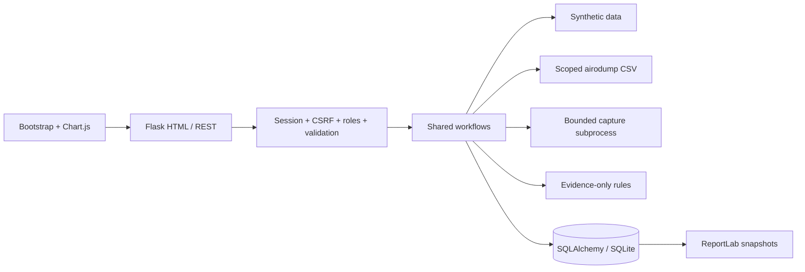

# Architecture

The application factory loads configuration/extensions. Authentication routes handle login/password/logout. HTML and REST blueprints require sessions and call identical workflow services, preventing API bypass of confirmation or scope checks.

## Trust boundaries

Browser inputs, wireless names and captures are untrusted. Jinja escapes HTML, ReportLab receives XML-escaped strings, SQLAlchemy binds query parameters, and scanners accept fixed argument arrays. No endpoint accepts a shell command, executable name, dictionary, output path or arbitrary target URL.

Capture parsing uses a separate process with a parent deadline and Linux CPU/address-space limits. This is resource isolation, not a complete sandbox: the child retains the service identity. Keep dependencies patched and use an isolated machine for hostile files.

## Relationships

Users own scans, assessments, captures, reports and audit events. Scans own observations linked to networks. `(bssid, demo)` is unique so synthetic data cannot overwrite real records. Assessments preserve evidence, rule configuration, authorization and permission-reference snapshots. Findings link to network and assessment; the latest findings carry `current=true`. Reports point to their original assessment. Revoking scope blocks new live operations but preserves history. Soft-deleted users keep attribution and lose session access.

SQLite foreign keys are enabled per connection. BSSID, timestamps, severity, audit action/user and observation references are indexed. See database/README.md for every table.

## Discovery lifecycle

1. Authenticate, check CSRF, validate confirmation and mode.
2. Check approved BSSID and detected monitor interface.
3. Persist running scan and audit event before invoking a tool.
4. Run fixed airodump arguments for 5–60 seconds, CSV only.
5. Terminate/reap the child, parse AP/station sections with row limits.
6. Refilter to scope and discard station probe lists.
7. Save observations, assessments and completion in a transaction.
8. Delete temporary files. Expected failures preserve a failed scan record.

Requests are synchronous and bounded. One process/four threads is the reference deployment. Concurrent live scans on one radio can interfere, so operate serially. Distributed radio locking, durable jobs and cancellation are future improvements.

## Capture lifecycle

Validate filename/extension/request size; save under a generated name privately; validate pcap/pcapng framing; stream packet decoding; identify scoped BSSIDs using ToDS/FromDS; retain only counts/protocol/channel metadata and fingerprint; delete raw file before persisting metadata. Four-address WDS traffic is excluded because it lacks a single clear BSSID in this implementation. Ethernet-only and nonmatching uploads fail explicitly.

## Rules and interface

Default labels: WEP Critical, open/legacy WPA High, TKIP Medium, unknown Low, WPA2/WPA3 Informational. Mixed modes can match multiple rules. These are local prioritization categories, not CVSS or exploitability scores. Client-side validation helps usability; server checks are authoritative. Local Bootstrap/Chart.js assets allow offline use, responsive pages, confirmations, notifications and charts.
